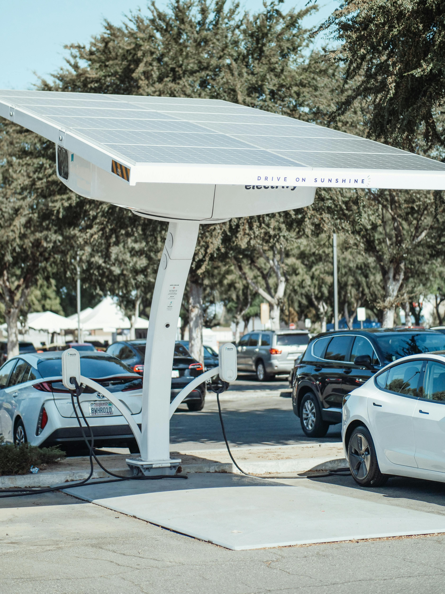
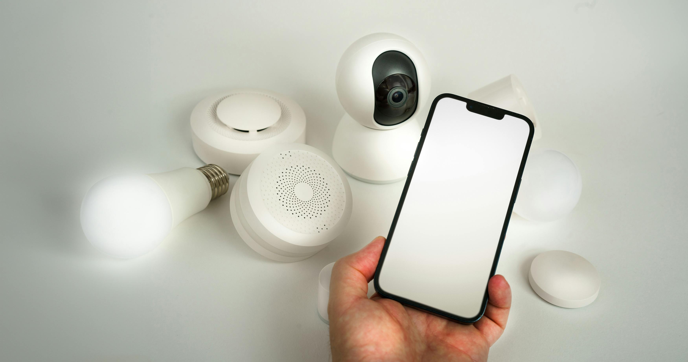

phpmyadmin. 
Right click anywhere, go tools, quick add then phpmyadmin.
start server and type in localhost/phpmyadmin = clicking database

LOGIN = root. no password

click new, create database, put name.

no caps or spaces in database.

screenshot my drawsql diagram, ask chatgpt to make it into SQL code phpmyadmin and for MySQL. press go, go on structure tab, and press data dictionary and take screenshots of the tables.

create a table, And then you can see the overview if you click on data dictionary 

when using the code for the website, unzip the folder first then open folder on vscode

video for tryout code
https://youtu.be/oYRda7UtuhA?si=a8mM2ZRBVttBLLpM

<!DOCTYPE html>
<html>
    <head>
        <meta name="viewport" content=""with=device-width, initial-scale="1.0">
        <title>Rolsa Technologies</title>
        <link rel="stylesheet" href="style.css">
        <link rel="preconnect" href="https://fonts.googleapis.com">
<link rel="preconnect" href="https://fonts.googleapis.com">
<link rel="preconnect" href="https://fonts.gstatic.com" crossorigin>
<link href="https://fonts.googleapis.com/css2?family=Dosis:wght@200..800&family=Lexend+Deca:wght@100..900&display=swap" rel="stylesheet">
<link rel="stylesheet" href="https://cdn.jsdelivr.net/npm/@fortawesome/fontawesome-free@6.6.0/css/fontawesome.min.css" integrity="sha384-NvKbDTEnL+A8F/AA5Tc5kmMLSJHUO868P+lDtTpJIeQdGYaUIuLr4lVGOEA1OcMy" crossorigin="anonymous">
    </head>
    <body>
        <section class="header">
            <nav>
                
                

                    <i class="fa fa-times" onclick="hideMenu()"></i>
                    <ul>
                        <li><a href="">HOME</a></li>
                        <li><a href="">ABOUT</a></li>
                        <li><a href="">SERVICES</a></li>
                        <li><a href="">PROJECTS</a></li>
                        <li><a href="">CONTACT</a></li>
                    </ul>
                

                <i class="fa fa-bars" onclick="showMenu()"></i>
            </nav>

        

            <h1>The Path to a Greener Society</h1>
            
Rolsa Technologies makes clean energy simple with solar panels, EV charging stations, and smart home energy systems.  Helping you save money while protecting the planet.

             <a href="" class="hero-btn">Learn More About Us!</a>       
        

        </section>
    
        

       <!----service---->

       <section class="service">
        <h1>Services We Provide</h1>

        

            

                <h3>Solar panel Consultation And Installation</h3>
                
Lorem ipsum dolor sit amet consectetur adipisicing elit. Aut, quidem enim. Velit ullam recusandae vero veritatis, ea fuga id illo iusto nulla quos explicabo fugit, molestiae, ipsa vel ad tenetur.

            

            

                <h3>Electric Vehicle Charging Station</h3>
                
Lorem ipsum dolor sit amet consectetur adipisicing elit. Iusto at adipisci blanditiis molestiae consectetur veritatis incidunt numquam tenetur atque assumenda corporis, aliquid facilis, quae eaque aspernatur. Laborum voluptatum veritatis neque.

            

            

                <h3>Smart Home Energy Management System</h3>
                
Lorem, ipsum dolor sit amet consectetur adipisicing elit. Quae assumenda quia fugiat harum quod voluptatem ea earum similique excepturi, dolorem, non ipsam amet beatae atque voluptatibus modi repellendus architecto at?

            

        

            </section>

       
       
        <!---about--->

       
       <section class="about">
        <h1>About Us</h1>
        
Lorem ipsum, dolor sit amet consectetur adipisicing elit. 

        
        

            

                
                

                    <h3>Solar Panel</h3>
                

            

            

                
                

                    <h3>EV Charging Station</h3>
                

            

            

                
                

                    <h3>Smart Home Energy Management System</h3>
                

            

        

    
    
    
       </section>

            <!---projects-->
        <section class="Projects">
            <h1> Our Projects</h1>
            
Lorem, ipsum dolor sit amet consectetur adipisicing elit.

            
            

                

                    
                    <h3> Solar Panel installation on massive company building</h3>
                

                

                    
                    <h3> Solar Panel installation on massive company building</h3>
                

                

                    
                    <h3> Solar Panel installation on massive company building</h3>
                

            

        
        
        
        </section>
    
    </body>

</html>

css

*{
    margin: 0;
    padding: 0;
    font-family: "Lexend Deca", sans-serif;
}
.header{
    min-height: 100vh;
    width: 100%;
    background-image: linear-gradient(rgba(4,9,30,0.7),rgba(4,9,30,0.7)),url(img/bannerpic.png);
    background-position: center;
    background-size: cover;
    position: relative;
}
nav{
    display: flex;
    justify-content: space-between;
    align-items: center;
}
nav img{
    width: 250px;
}
.nav-links{
    flex: 1;
    text-align: right;
    padding: 8px 50px;
}
.nav-links ul li{
    list-style: none;
    display: inline-block;
    padding: 8px 12px;
    position: relative;
}
.nav-links ul li a{
    color: #fff;
    text-decoration: none;
    font-size: 20px;
}
.nav-links ul li::after{
    content: '';
    width: 0%;
    height: 2px;
    background: #2ab425;
    display: block;
    margin: auto;
    transition: 0.5s;
}
.nav-links ul li:hover::after{
    width: 100%; 
}
.text-box{
    width: 90%;
    color: #fff;
    position: absolute;
    top: 50%;
    left: 50%;
    transform: translate(-50%,-50%);
    text-align: center;
}
.text-box h1{
    font-size: 62px;
}
.text-box p{
    margin: 10px 0 40px;
    font-size: 16px;
    color: #fff;
}
.hero-btn{
    display: inline-block;
    text-decoration: none;
    color: #fff;
    border: 1px solid #fff;
    padding: 12px 34px;
    font-size: 13px;
    background: transparent;
    position: relative;
    cursor: pointer;
}
.hero-btn:hover{
    border: 1px solid #1fad26;
    background: #1fad26;
    transition: 1s;
}

nav .fa{
    display: none;
}

nav .fa{
    display: none;
}

@media(max-width: 700px){
    .text-box h1{
        font-size: 20px;
    }
    .nav-links ul li{
        display: block;
    }
    .nav-links{
        position: absolute;
        background: #1fad26;
        height: 100vh;
        width: 200px;
        top: 0;
        right: -200px;
        text-align: left;
        z-index: 2;
        transition: 1s;

    }
    nav .fa{
        display: block;
        color: #fff;
        margin: 10px;
        font-size: 22px;
        cursor: pointer;
    }
    .nav-links ul{
        padding: 30px;
        
    }
}

/*----service----*/

.service{
    width: 80%;
    margin: auto;
    text-align: center;
    padding-top: 100px;
}
h1{
    font-size: 36px;
    font-weight: 600;
}
p{
    color: #000000;
    font-size: 14px;
    font-weight: 300;
    line-height: 22px;
    padding: 10px;
}
.serv{
    margin: top 5%;
    display: flex;
    justify-content: space-between;
}
.servtype{
    flex-basis: 31%;
    background: #fff3f3;
    border-radius: 10px;
    margin-bottom: 5%;
    padding: 20px 12px;
    box-sizing: border-box;
    transition: 0.5s;
}
h3{
    text-align: center;
    font-weight: 600;
    margin: 10px 0;
}
.servtype:hover{
    box-shadow: 0 0 20px 0px rgba(0,0,0,0.2);
}
@media(max-width: 700px){
    .servtype{
        flex-direction: column;
    }
}

/*---about  us---*/

.about{
    width: 80%;
    margin: auto;
    text-align: center;
    padding-top: 50px;
}
.aboutpic{
    flex-basis: 32%;
    border-radius: 10px;
    margin-bottom: 30px;
    position: relative;
    overflow: hidden;
    width: 100%;
}
.aboutpic img{
    width: 100%;
    display: block;
}
.layer{
    background: transparent;
    height: 100%;
    width: 100%;
    position: absolute;
    top: 0;
    left: 0;
    transition: 0.5s;
}
.layer:hover{
    background: rgba(130, 228, 130, 0.7);
}
.layer h3{
    width: 100%;
    font-weight: 500;
    color:#fff;
    font-size: 26px;
    bottom: 0;
    left: 50%; 
    transform: translateX(-50%);
    position: absolute;
    opacity: 0;
    transition: 0.5s;
}
.layer:hover h3{
    bottom: 49%;
    opacity: 1;

}
/*---- Projects ----*/

.Projects{
    width: 80%;
    margin: auto;
    text-align: center;
    padding-top: 100px;
}

/*--- about page---*/
body {
    font-family: Arial, sans-serif;
    line-height: 1.6;
    margin: 0;
    padding: 0;
    background-color: #f4f4f4;
}

header {
    background: #007BFF;
    color: #fff;
    padding: 10px 0;
    text-align: center;
}

nav ul {
    list-style: none;
    padding: 0;
}

nav ul li {
    display: inline;
    margin: 0 15px;
}

nav ul li a {
    color: #fff;
    text-decoration: none;
}

main {
    padding: 20px;
}

.about {
    background: #fff;
    padding: 20px;
    border-radius: 5px;
    box-shadow: 0 0 10px rgba(0, 0, 0, 0.1);
}

.about h2 {
    color: #007BFF;
}

footer {
    text-align: center;
    padding: 10px 0;
    background: #007BFF;
    color: #fff;
    position: relative;
    bottom: 0;
    width: 100%;
}

ABOUT PAGE

<html lang="en">
 <head>
  <meta charset="utf-8"/>
  <meta content="width=device-width, initial-scale=1.0" name="viewport"/>
  <title>
   Rolsa Technologies
  </title>
  
  <link href="https://cdnjs.cloudflare.com/ajax/libs/font-awesome/5.15.3/css/all.min.css" rel="stylesheet"/>
  <link href="https://fonts.googleapis.com/css2?family=Roboto:wght@400;700&amp;display=swap" rel="stylesheet"/>
  <link href="style.css" rel="stylesheet"/>
 </head>
 <body class="bg-gray-100">
  <header class="bg-black text-white p-4 flex justify-between items-center">
   

    ROLSA TECHNOLOGIES
   

   <nav class="space-x-4">
    <a class="text-white" href="#">
     HOME
    </a>
    <a class="text-green-500" href="#">
     ABOUT
    </a>
    <a class="text-white" href="#">
     SERVICES
    </a>
    <a class="text-white" href="#">
     PROJECTS
    </a>
    <a class="text-white" href="#">
     CONTACT
    </a>
   </nav>
   <a class="bg-green-500 text-white px-4 py-2 rounded" href="#">
    SIGN IN
   </a>
  </header>
  <main class="container mx-auto mt-4">
   
   

    

     
     

      OUR FOUNDERS
     

    

    

     
     

      WHY WE STARTED
     

    

    

     
     

      OUR MAIN GOAL
     

    

    

     
     

      HOW WE HELP
     

    

    

     
     

      WANT TO JOIN?
     

    

    

     
     

      MEET OUR TEAM
     

    

   

   

    <h2 class="text-2xl font-bold">
     HIRE OUR SERVICE NOW
     <i class="fas fa-arrow-right">
     </i>
    </h2>
   

  </main>
  <footer class="bg-green-500 text-white mt-8">
   

    

     

      ADDRESS
     

     

      123 MAIN HIGH ROAD
     

     

      +44123456789
     

    

    

     

      NEWSLETTER
     

     

      Subscribe to our newsletter for the latest updates.
     

     

      info@bolsa.com
     

    

    

     <a class="bg-white text-green-500 px-4 py-2 rounded" href="#">
      CONTACT US
     </a>
    

   

  </footer>
 </body>
</html>
